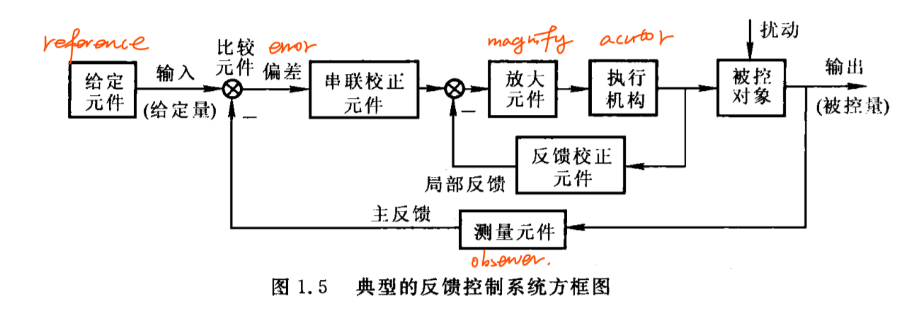

## 1.常见控制方式
开环控制
- 系统的**控制作用不受输出影响**的控制系统
- 在开环控制系统中,输人端与输出端之间,只有信号的前向通道而不存在由输出端到输人端的反馈通路。

闭环控制
- 开环控制系统精度不高和适应性不强的主要原因是缺少从系统输出到输入的反馈回路
- 若要提高控制精度,就必须把输出量的信息反馈到输人端,通过比较输入值与输出值,产生偏差信号,该偏差信号以一定的控制规律产生控制作用,逐步减小以至消除这一偏差,从而实现所要求的控制性能
- 系统的**控制作用受输出量影响**的控制系统称闭环控制系统。

优缺点：
- 一般来说,开环控制系统结构比较简单,成本较低。开环控制系统的缺点是控制精度不高,抑制干扰能力差,而且对系统参数变化比较敏感,一般用于可以不考虑外界影响或精度要求不高的场合,如洗衣机、步进电机控制及水位调节等
- 在闭环控制系统中,不论是输人信号的变化,或者干扰的影响,或者系统内部的变化,只要是被控量偏离了规定值,都会产生相应的作用去消除偏差。因此,闭环控制抑制干扰能力强,与开环控制相比,系统对参数变化不敏感,可以选用不太精密的元件构成较为精密的控制系统,获得满意的动态特性和控制精度。但是采用反馈装置需要添加元部件,造价较高,同时也增加了系统的复杂性。如果系统的结构参数选取不适当,控制过程则可能变得很差,甚至出现振荡或发散等不稳定的情况。

## 2.自控系统的基本组成

## 3.控制系统的分类
1.按给定信号形式分
- 恒值控制系统：恒值控制系统(也称为定值系统或调节系统）的控制输入是恒定值,要求被控量保持给定值不变,例如,前面提到的液位控制系统、直流电动机调速系统等
- 随动控制系统：随动控制系统(也称为同服系统〉的控制输入是变化规律未知的时间函数,系统的任务是使被控量按同样的规律变化,并与输入信号的误差保持在规定范围内,例如,函数记录仪、自动火炮系统和飞机-自动驾驶仪系统等
- 程序控制系统：程序控制系统的给定信号按预先编制的程序确定,要求被控量按相应的规律随控制信号变化,机械加工中的数控机床就是典型的例子

2.定常与非定常
3.线性与非线性
4.连续与离散
5.SISO与MIMO

## 4.系统性能要求
- 实际的物理系统中都存在惯性元件或者储能元件，所以系统的输出量和反馈量总是滞后于输入量的变化，所以系统达到平衡状态总要经历一定时间。
- 系统初始状态--->最终稳态：过渡过程（瞬态过程）
- 之后：稳态过程
- 性能指标：稳、准、快
  - 稳：系统重新恢复平衡状态的能力
  - 准：稳态过程中系统输出量的实际值与期望值之差
  - 快：系统过渡到平衡状态的调节时间短

## 5.研究内容
- 系统分析
- 系统设计

