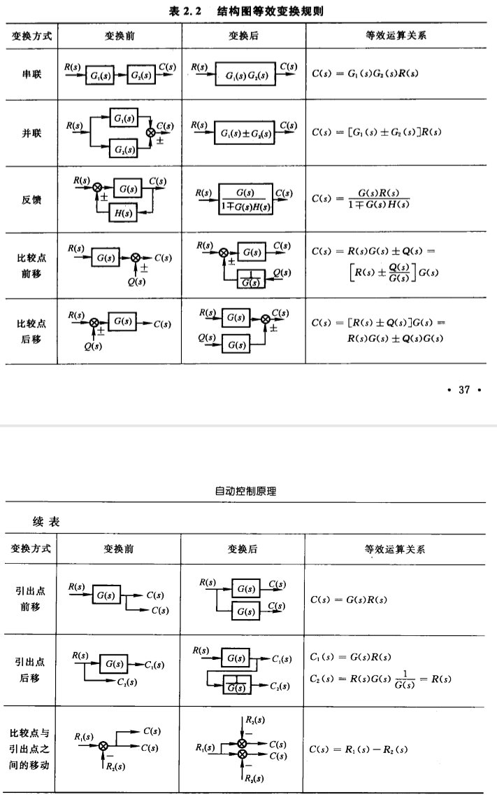
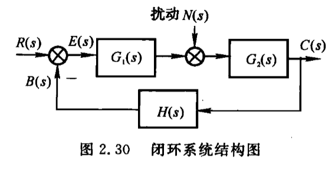

## 1.传递函数
零初条件下，LTI系统的输出量的拉氏变换比上输入量的拉氏变换。
$$
G(s)=\frac{N(s)}{D(s)}=\frac{b_ms^m+b_{m-1}s^{m-1}+...+b_1s+b_0}{a_ns^n+a_{n-1}s^{n-1}+...+a_1s+a_0}
$$

性质：
- 实际物理系统存在惯性，分母阶次n总是大于分子阶次m，$m\leq n$
- 传递函数的拉氏变换为系统的脉冲响应
- 局限在零初条件下，非零初条件下不能使用
- 一般只适用于SISO系统
- 只适用于线性系统

## 2.拉氏变换
### 相关定理
- 线性：$\mathcal{L}[af(t)+bg(t)]=aF(t)+bG(t)$
- 微分：$\mathcal{L}[f^{'}(t)]=sF(s)-f(0)$
- 积分：$\mathcal{L}[\int f(t)dt]=\frac{1}{s} F(s)+\frac{1}{s}f^{-1}(0)$
- 初值：$\lim_{t\to 0}f(t)=\lim_{s \to \infty}sF(s)$
- 终值：$\lim_{t \to \infty}=\lim_{s\to 0}sF(s)$
- 实位移：$\mathcal{L}[f(t-\tau_0)]=e^{-\tau_0 t}F(s)$
- 虚位移：$\mathcal{L}[e^{At}f(t)]=F(s-A)$

### 留数法
$$
\begin{aligned}
F(s) & =\frac{B(s)}{A(s)}=\frac{b_ms^m+b_{m-1}s^{m-1}+...+b_1s+b_0}{a_ns^n+a_{n-1}s^{n-1}+...+a_1s+a_0}        \\
     & =\frac{(s-z_1)...(s-z_m)}{(s-p_1)...(s-p_n)}   \\
\end{aligned}
$$

- $A(s)=0$无重根时
$$
F(s)=\frac{C_1}{s-p1}+\frac{C_2}{s-p_2}+...+\frac{C_n}{s-p_n}=\Sigma^n_{i=1}\frac{C_i}{s-p_i}
$$

解$C_i$:
$$
\begin{aligned}
C_i & = \frac{B(s)}{A^{'}(s)}\bigg|_{s=p_i}     \\
C_i & = \lim_{s \to p_i}(s-p_i)F(s)             \\
\end{aligned}
$$

- $A(s)=(s-p_1)(s-p_1)...(s-p_n)=0$有重根时，$p_1$为m重根
$$
F(s)=\frac{C_m}{(s-p_1)^m}+\frac{C_{m-1}}{(s-p_1)^{m-1}}+...+\frac{C_1}{s-p_1}+\frac{C_{m+1}}{s-p_{m+1}}+...+\frac{C_m}{s-p_m}
$$

其中$C_{m+1}...C_n$用留数法求
对于$C_m...C_1$:
$$
C_{m-j}=\frac{1}{j!}\lim_{s \to p_1}\frac{d^j[(s-p_1)^mF(s)]}{d s^j}
$$

## 3.典型环节
|  序号   |  名称 |   微分方程  | 传递函数 |
|:-:|:-:|:-:|:-:|
| 1 | 比例环节 | $c=kr$         | $k$              |
| 2 | 惯性环节 | $T\dot{c}+c=r$ | $\frac{1}{Ts+1}$ |
| 3 | 振荡环节 | $T^2\ddot{c}+2\xi Ts+1=r,0<\xi<1$ | $\frac{1}{T^2s^2+2\xi Ts+1}$ |
| 4 | 积分环节 | $\dot{c}=r$    | $\frac{1}{s}$    |
| 5 | 微分环节 | $c=\dot{r}$    | $s$              |
| 6 | 一阶复合环节 | $c=\tau\dot{r}+r$ | $\tau s+1$  |
| 7 | 二阶符合环节 | $c=\tau^2 \ddot{r}+2\tau\xi\dot{r}+r$ | $\tau^2s^2+2\xi\tau s+1$ |

## 4.传递函数的标准形式
- 首1标准型:将传递函数的分子、分母的最高次项系数化为1
$$
\begin{aligned}
G(s) & = \frac{K^* \prod^m_{j=1}(s-z_j)}{\prod^n_{i=1}(s-p_i)}   \\
     & = \frac{K^*(s-z_1)(s-z_2)...(s-z_m)}{(s-p_1)(s-p_2)...(s-p_n)}
\end{aligned}
$$

- 尾1标准型:将传递函数的分子、分母的最低次项系数化为1
$$
G(s)  = K \frac{\prod^{m_1}_{k=1}(\tau_k s+1) \prod_{l=1}^{m_2}(\tau_l^2 s^2+2\xi\tau_l s+1)}{s^v\prod^{n_1}_{i=1}(T_is+1)\prod_{j=1}^{n_2}(T_j^2s^2+2\xi T_js+1)}   
$$
其中k称为增益
k与$k^*$的关系：
$$
K=K^* \frac{\prod^m_{j=1}|z_j|}{\prod^n_{i=1}|p_i|}
$$

## 5.结构图等效原则

## 6.系统的开环传递函数
人为的断开系统的主反馈通路，将前向通路与反馈通路上的传递函数乘在一起，一般用$G(s)H(s)$表示，此处的开环传递函数是针对一个闭环的系统而言的，并不是指开环系统的传递函数

针对上述系统，其开环传递函数为
$$
G(s)H(s)=G_1(s)G_2(s)H(s)
$$

## 7.闭环系统的传递函数

- 研究控制输入作用时，令扰动为零$N(s)=0$，闭环传递函数为：
$$
\Phi(s)=\frac{C(s)}{R(s)}=\frac{G_1(s)G_2(s)}{1+G_1(s)G_2(s)H(s)}
$$

- 研究干扰作用下的闭环传递函数，令输入为零$R(s)=0$，此时闭环传递函数为：
$$
\Phi_N(s)=\frac{C(s)}{N(s)}=\frac{G_2(s)}{1+G_1(s)G_2(s)H(s)}
$$

- 根据叠加原理，系统的总输出=输入作用下输出+干扰作用下输出
$$
C(s)=\Phi(s)R(s)+\Phi_N(s)R(s)=\frac{G_1(s)G_2(s)+G_2(s)}{1+G_1(s)G_2(s)H(s)}R(s)
$$

## 8.闭环系统的误差传递函数
- 输入作用时，$N(s)=0$
$$
\Phi_e(s)=\frac{E(s)}{R(s)}=\frac{1}{1+G_1(s)G_2(s)H(s)}
$$

- 干扰作用时，$R(s)=0$
$$
\Phi_{eN}(s)=\frac{E(s)}{N(s)}=\frac{-G_2(s)H(s)}{1+G_1(s)G_2(s)H(s)}
$$

- 叠加后，总误差为
$$
E(s)=\Phi_e(s)R(s)+\Phi_{eN}(s)N(s)=\frac{R(s)-G_2(s)H(s)N(s)}{1+G_1(s)G_2(s)H(s)}
$$