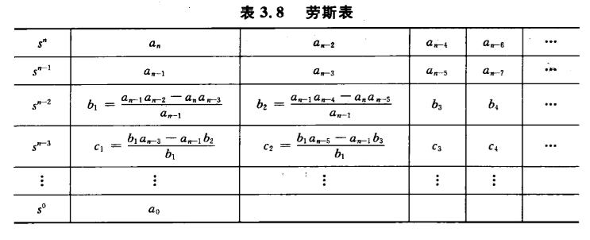
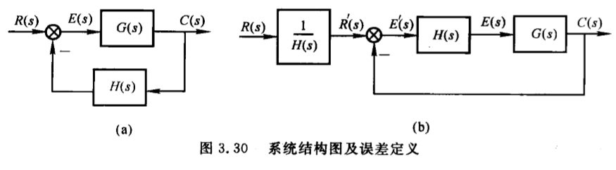
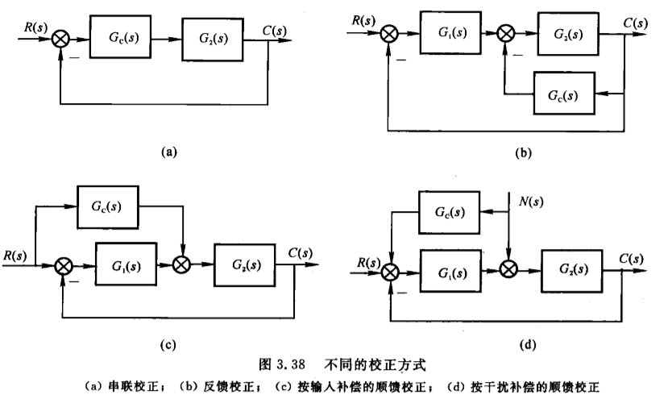
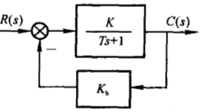
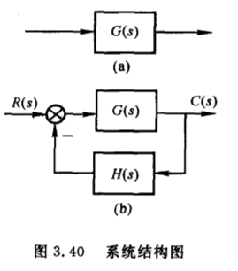
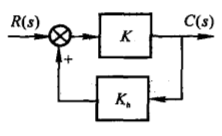
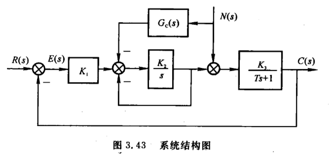

## 1.高阶系统的阶跃响应与动态性能
### 高阶系统传递函数一般形式：
$$
\begin{aligned}
\Phi(s)=\frac{M(s)}{D(s)} & = \frac{b_ms^m+b_{m-1}s^{m-1}+...+b_1s+b_0}{a_ns^n+a_{n-1}s^{n-1}+...+a_1s+a_0} \\
& =\frac{K\prod_{i=1}^m(s-z_i)}{\prod_{j=1}^q(s-\lambda_j) \prod_{k=1}^r(s^2+2\xi_k \omega_k s +\omega_k^2)}    \\
\end{aligned}
$$

其中$K=\frac{b_m}{a_n}$,$q+2r=n$（因为后面的$s^2+2\xi_k \omega_k s +\omega_k^2$会有两个实根或重根或复根）

---

### 其阶跃响应拉氏变换：
$$
\begin{aligned}
c(s)=\Phi(s)\frac{1}{s}& =\frac{K\prod_{i=1}^m(s-z_i)}{s\prod_{j=1}^q(s-\lambda_j) \prod_{k=1}^r(s^2+2\xi_k \omega_k s +\omega_k^2)}    \\

& =\frac{A_0}{s}+\sum_{j=1}^q\frac{A_j}{s-\lambda_j}+\sum_{k=1}^r\frac{B_ks+C_k}{s^2+2\xi_k\omega_ks+\omega_k^2}
\end{aligned}
$$

拉氏反变换后的时域输出为：
$$
c(t)=A_0+\sum_{j=1}^qA_je^{j\lambda_jt}+\sum_{k=1}^rD_ke^{-\sigma_kt}sin(\omega_{dk}t+\phi_k)
$$

---
### 闭环主导极点
前提：针对一个稳定收敛的系统
- 远离虚轴的极点对应的模态收敛速度较快，仅影响阶跃响应起始部分
- 距离虚轴较近的极点模态衰减缓慢，系统的动态性能主要取决于这些极点对应的响应分量
- **距离虚轴最近并且周围没有零点的极点对系统的动态性能起着主导作用，称为主导极点**

### 估算高阶系统动态性能指标的零点极点法
可忽略的极点情况：
- 某极点的实部大于**主导极点**5~6倍以上时
- 两相邻零、极点之间的距离比他们本身的模值小一个数量级时，该零、极点对为**偶极子**，其对响应的作用近似抵消

忽略部分极点后参照表，根据剩余的闭环零极点分布情况进行估算

---

## 2.线性系统的稳定性分析
稳定性：扰动的加入使得系统偏离了平衡状态，当扰动消失后，系统恢复到平衡的能力

### 2.1稳定的**充分必要条件**：
系统闭环传递函数的**所有特征根都具有负的实部**
或
系统的**闭环特征根均位于左半s平面**

### 2.1稳定性判据
- 判定稳定性的必要条件
系统的特征方程为：
$$
D(s)=a_ns^n+a_{n-1}^{n-1}+...+a_1s+a_0 ,(a_n>0)
$$

必要条件：
$$
a_i>0 (i=0,1,2,...,n-1)
$$

满足此必要条件的一二阶系统必然稳定，但是高阶系统不一定，高阶系统还需要用**劳斯判据**来判断
- 劳斯判据
劳斯表：

有规律

- 系统稳定的充分必要条件为：**劳斯表中第一列系数都大于0，否则系统不稳定**
- 第一列系数**符号改变的次数**就是系统特征方程中**正实根的个数**

## 3.线性系统的稳态误差
- 稳态误差是系统的稳态性能指标
- 稳定的系统研究稳态误差才有意义
- 无差系统：阶跃输入下，没有原理性稳态误差的系统
- 有差系统：阶跃输入下，有原理性误差的系统

### 3.1误差与稳态误差

误差：
- 按输入端定义误差：(将偏差定义为误差)
$$E(s)=R(s)-C(s)H(s)$$
- 按输出端定义误差：
$$E^{'}(s)=\frac{R(s)}{H(s)}-C(s)$$

- 两者之间存在关系：
$$E^{'}(s)=\frac{E(s)}{H(s)}$$

稳态误差（两种含义）：
- 时间趋于无穷大时误差的值：$e_{ss}=\lim_{t \to \infty}e(t)$，为**静态误差**或终值误差
- 误差$e(t)$中的稳态分量$e_s(t)$,称为动态误差

### 3.2计算稳态误差
A.计算静态误差，利用终值定理

步骤：
- 1.判断系统的稳定性。不稳定系统终值定理不适用
- 2.求误差传递函数
$$\phi_e(s)=\frac{E(s)}{R(s)},\phi_{en}(s)=\frac{E(s)}{N(s)}$$
- 3.利用终值定理计算
$$e_{ss}=\lim_{t \to \infty}e(t)=\lim_{s \to 0}sE(s)=\lim_{s \to 0}[\phi_e(s)R(s)+\phi_{en}(s)N(s)]$$

B.静态误差系数法
如上图的系统，其开环传递函数可表示为：
$$
G(s)H(s)=\frac{K(\tau_1s+1)...(\tau_ms+1)}{s^v(T_1s+1)...(T_{n-v}s+1)}=\frac{K}{s^v}G_0(s)
$$

其中
$$
G_0(s)=\frac{(\tau_1s+1)...(\tau_ms+1)}{(T_1s+1)...(T_{n-v}s+1)}
$$

K为开环增益
v为系统开环传递函数中**纯积分环节**的个数，称为**系统型别**或**无差度**

- v=0时，对应的闭环系统为0型系统，称为 有差系统
- v=1时，1型系统或一阶无差系统
- v=2时，2型系统或二阶无差系统

仅输入r(t)作用下的误差传递函数又可表示为
$$
\phi_e(s)=\frac{E(s)}{R(s)}=\frac{1}{1+G(s)H(s)}=\frac{1}{1+\frac{K}{s^v G_0(s)}}
$$

讨论各种输入下的静态位置误差系数：
- 1.阶跃输入时$r(t)=A1(t)$
$$
\begin{aligned}
e_{ss} & = \lim_{s \to 0}s\phi_e(s)R(s)   \\
       & = \lim_{s \to 0}s\frac{A}{s}\frac{1}{1+G(s)H(s)}   \\
       & = \lim_{s \to 0}\frac{A}{1+G(s)H(s)}   \\
       & = \frac{A}{1+\lim_{s \to 0}G(s)H(s)}
\end{aligned}
$$

定义静态位置误差系数为：
$$
K_p=\lim_{s \to 0}G(s)H(s)=\lim_{s \to 0}\frac{K}{s^v}
$$

稳态误差可表示为：
$$
e_{ss}=\frac{A}{1+K_p}
$$

- 2.速度输入时$r(t)=At$
$$
\begin{aligned}
e_{ss} & = \lim_{s \to 0}s\phi_e(s)R(s) \\
       & = \lim_{s \to 0}s\frac{A}{s^2}\frac{1}{1+G(s)H(s)}   \\
       & = \lim_{s \to 0}\frac{A}{s+sG(s)H(s)}   \\
\end{aligned}
$$

定义静态速度误差系数为：
$$
K_v=\lim_{s \to 0}sG(s)H(s)=\lim_{s \to 0}\frac{K}{s^{v-1}}
$$

稳态误差可表示为：
$$
e_{ss}=\frac{A}{K_v}
$$

- 3.加速度输入时，$r(t)=\frac{A}{2}t^2$
$$
\begin{aligned}
e_{ss} & = \lim_{s \to 0}s\phi_e(s)R(s)   \\
       & = \lim_{s \to 0}s\frac{A}{s^3}\frac{1}{1+G(s)H(s)}   \\
       & = \lim_{s \to 0}\frac{A}{s^2}\frac{1}{1+G(s)H(s)}   \\
       & = \frac{A}{\lim_{s \to 0}s^2G(s)H(s)}  \\
\end{aligned}
$$

定义静态加速度误差系数为：
$$
K_a=\lim_{s \to 0}s^2G(s)H(s)=\lim_{s \to 0}\frac{K}{s^{v-2}}
$$

稳态误差可表示为：
$$
e_{ss}=\frac{A}{K_a}
$$

总结:控制输入作用下系统稳态误差随系统结构、参数、输入形式变化的规律

|系统型别||||$r(t)=A1(t)$|$r(t)=At$|$r(t)=\frac{A}{2}t^2$|
|:-:|:-:|:-:|:-:|:-:|:-:|:-:|
||$k_p=\lim_{s \to 0}\frac{K}{s^v}$|$k_v=\lim_{s \to 0}\frac{K}{s^{v-1}}$|$k_a=\lim_{s \to 0}\frac{K}{s^{v-2}}$|$e_{ss}=\frac{A}{1+K_p}$|$e_{ss}=\frac{A}{K_v}$|$e_{ss}=\frac{A}{K_a}$|
|0|$K$|0|0|$\frac{A}{1+K}$|$\infty$|$\infty$|
|1|$\infty$|$K$|0|0|$\frac{A}{K}$|$\infty$|
|2|$\infty$|$\infty$|$K$|0|0|$\frac{A}{K}$|

- 系统稳定时，增大开环增益K，可以减小稳态误差
- 纵向看，增加开环传递函数中积分环节数，可消除稳态误差
- 系统型别是系统响应达到稳态时，输出跟踪输入信号的一种能力储备
- 系统回路中的积分环节越多，系统稳态输出跟踪输入信号的能力越强
- 但积分环节越多，系统越容易不稳定，实际系统2型以上很少

C.干扰引起的稳态误差
$$
\begin{aligned}
e_{ssn} & = \lim_{s \to 0} s\phi_{en}(s)N(s)       \\
        & = \lim_{s \to 0} \frac{-G_2(s)H(s)}{1+G_1(s)G_2(s)H(s)}N(s)       \\
\end{aligned}
$$

当$|G_1(s)G_2(s)H(s)|\ge 1$时
$$
e_{ssn}\approx \lim_{s \to 0}s \frac{-1}{G_1(s)}N(s)
$$

**D.动态误差系数**
- 思路：将系统的误差传递函数$\phi_{e}(s)=\frac{E(s)}{R(s)}$在s=0处展开成泰勒级数：
$$
\begin{aligned}
\phi_e(s) & = \phi_e(0)+\frac{1}{1!}\phi_e^{'}(0)s+\frac{1}{2!}\phi_e^{''}(0)s^2+...+\frac{1}{l!}\phi_e^{(l)}(0)s^l+...     \\
\end{aligned}
$$

$$
c_i=\frac{1}{i!}\phi_e^{(i)}(0)s^i
$$

$$
\begin{aligned}
\phi_e(s) & = c_0+c_1s+c_2s^2+...   \\
     E(s) & = \phi_e(s)R(s)=c_0R(s)+c_1R(s)s+c_2R(s)s^2+...  \\
e_s(t) & = c_0r(t)+c_1r^{'}(t)+c_2r^{''}(t)+...  \\
       & = \Sigma_{i=0}^\infty c_ir^{(i)}(t)     \\

\end{aligned}
$$

注：上式是$\phi_e(s)$在s=0处展开的，对应于时域中$t \to \infty$时的特性，所以只含有$e(t)$中的稳态分量$e_s(t)$

对于适用静态误差系数法求稳态误差的系统，静态误差系数和动态误差系数之间存在一定的关系
$$
\begin{aligned}
0型系统：c_0 & = \frac{1}{1+K_p}    \\
1型系统：c_1 & = \frac{1}{K_v}      \\
2型系统：c_2 & = \frac{1}{K_a}      \\
\end{aligned}
$$

## 4.系统的时域校正
- 在系统中加入一些参数和结构可调整的装置，如微分积分电路或速度传感器，来改变系统的结构，提高系统的性能
- 在不改变系统基本部分的前提下，选择合适的校正装置，并计算确定其参数，使系统满足各项性能指标
- 常见的校正方式：串联校正、反馈校正、顺馈校正

$G_c(s)$为待求得校正装置传递函数

### 4.1反馈校正
定义：在主反馈环内，为改善系统的性能而加入反馈装置的校正方式

作用：
**1.比例负反馈可以减小被包围环节的时间常数，削弱被包围环节的惯性，提高响应的快速性**

$G(s)=\frac{K}{Ts+1}$被比例负反馈包围后，新系统传递函数为：
$$
\begin{aligned}
G^{'}(s) & = \frac{K}{Ts+1+KK_h}=\frac{K^{'}}{T^{'}s+1}  \\
T^{'}    & = \frac{T}{1+KK_h}      \\
K^{'}    & = \frac{K}{1+KK_h}      \\
\end{aligned}
$$

比较后发现：$T^{'}<T,K^{'}<K$，得出系统被比例负反馈包围后，时间常数减小带来更快收敛速度，增益同时也降低，可能需要补偿。

**2.负反馈可以降低参数变化或系统中不希望有的特性对于系统的影响（如非线性特性）**

对于此原系统（未加反馈），若因某些原因，系统传递函数产生一个增量$\Delta G(s)$，系统输出变为：
$$
C(s)+\Delta C(s)=[G(s)+\Delta G(s)]R(s)
$$

此时增量输出为：
$$
\Delta C(s)=\Delta G(s)R(s)
$$

给此系统包围负反馈，形成闭环系统后，系统输出为：
$$
C(s)+\Delta C(s)=\frac{G(s)+\Delta G(s)}{1+[G(s)+\Delta G(s)]H(s)} R(s)
$$

此时增量输出为：
$$
\Delta C(s)=\frac{\Delta G(s)}{1+[G(s)+\Delta G(s)]H(s)} R(s) \approx \frac{\Delta G(s)}{1+G(s)H(s)} R(s)
$$

对比未加反馈时系统，增加反馈后，有效减小了增量$\Delta G(s)$导致的系统增量输出$\Delta C(s)$

若系统中某环节性能很差，影响了整个系统的性能，可以采用局部负反馈包围此环节，来抑制其不良影响

 **3.合理利用正反馈可以提高放大倍数**

此系统中前向通道中放大倍数为K，使用**正反馈**后放大倍数为：
$$
\frac{K}{1-KK_h}
$$
若取$K_h \approx \frac{1}{K}$，可以大幅度的增大闭环的放大倍数。但是可能会出现负面效果

 ### 4.2复合校正

定义：在闭环内部使用串联校正或反馈校正，同时在闭环外部使用顺馈校正

**1.按干扰补偿的顺馈控制**

- 将干扰信号通过前馈通道引入闭环回路中，形成按干扰补偿的复合控制
- 合理设计，可以有效减小干扰作用下的稳态误差

