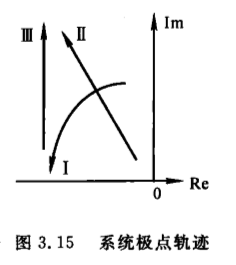
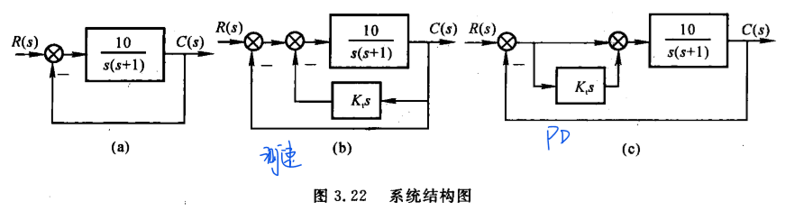

## 1.作用与特点
- 直接在时间域内对系统进行分析和校正
- 不方便
- 最基本的方法
- 是以后学习复域法、频域法的基础

---
---

## 2.时域性能指标
- 动态性能指标

  - 延迟时间$t_d$：阶跃响应第一次到达终值的50%的时间
  - 上升时间$t_r$：阶跃响应从终值的10%上升到终值的90%所需的时间
  - 峰值时间$t_p$：阶跃响应超过终值达到第一个峰值的时间
  - **调节时间**$t_s$：阶跃响应保持在终值$\pm$ 5%误差带内的时间
  - 超调量$\sigma$ %：
  $$\sigma\%=\frac{h(t_p)-h(\infty)}{h(\infty)}\times100\%$$

- 稳态性能指标：时间趋于无穷时系统实际输出与理想输出之间的误差

---
---

## 3.一阶系统的时间响应及动态性能
标准闭环传递函数形式：
$$
\Phi(s)=\frac{1}{Ts+1}
$$

其中T为时间常数

其阶跃响应为：
$$
h(t)=1-e^{-\frac{t}{T}}
$$

调节时间：$t_s=3T$

---
---

## 4.二阶系统的时间响应及动态性能指标
标准闭环传递函数形式：
$$
\begin{aligned}
\Phi(s) & =\frac{1}{T^2s^2+2T\xi s+1}    \\
\Phi(s) & =\frac{\omega_n^2}{s^2+2\xi\omega_ns+\omega_n^2}      \\
\end{aligned}
$$
其中$\xi$为阻尼比，$\omega_n$为无阻尼自然频率

闭环特征方程为：
$$
D(s)=s^2+2\xi\omega_ns+\omega_n^2=0
$$

其根为：
$$
\lambda_{1,2}=-\xi\omega_n\pm \omega_n\sqrt{\xi^2-1}
$$

---

- 1.$\xi>1$时为过阻尼情况

根为$\lambda_{1,2}=-\xi\omega_n\pm \omega_n\sqrt{\xi^2-1}$,是两个实根，分布：

调节时间$t_s$查表得

---
- 2.$\xi=1$时为临界阻尼情况

根为$\lambda_{1,2}=-\omega_n$，为两个相等得实根
分布：

---

- 3.$\xi=0$时为零阻尼情况
根为$\lambda_{1,2}=\pm i\omega_n$，为两个对称复根
分布：

---

- 4.$0<\xi<1$时为**欠阻尼**情况
根为$\lambda_{1,2}=-\xi\omega_n\pm i\omega_n\sqrt{1-\xi^2}$
分布：

根的极坐标表示为：

发现：
$$
\begin{aligned}
cos\beta  & = \frac{\xi \omega_n}{\omega_n}=\xi   \\
sin\beta  & = \frac{\omega_n\sqrt{1-\xi^2}}{\omega_n}=\sqrt{1-\xi^2}                         \\
|\lambda| & = \omega_n                            \\
\end{aligned}
$$

峰值时间：$t_p=\frac{\pi}{\omega_n\sqrt{1-\xi^2}}$

超调量：$\sigma\%=e^{-\xi\pi/\sqrt{1-\xi^2}}\times100\%$

调节时间：$t_s=\frac{3.5}{\xi\omega_n}$

---

### 欠阻尼系统极点分布对动态性能的影响

- 1.$\omega_n$不变，$\xi$增大（$\beta$角减小）时
  - 极点按图中曲线1运动
  - 超调量减小
  - 调节时间变短

- 2.$\xi$（$\beta$角）不变，$\omega_n$增大时
  - 极点按图中曲线2运动
  - 超调量不变
  - 调节时间变短

- 3.一般实际系统
  - 极点按图中曲线3运动
  - 超调量增大

---
---

## 测速反馈与PD控制---改善二阶系统动态性能的措施

闭环传递函数：
- 原始：$\Phi(s)=\frac{10}{s^2+(1+10K_t)s+10}$
- 测速：$\Phi(s)=\frac{10}{s^2+(1+10K_t)s+10}$
- P-D: $\Phi(s)=\frac{10(K_t+1)}{s^2+(1+10K_t)s+10}$

分析：
- 从物理本质上：
  - 测速反馈增大了原系统的阻尼比，**抑制了系统的振荡性**，减小了超调量
  - PD控制中微分具有超前性，将系统的调节作用提前，阻止了系统的过调
  
- 从实际实现上：
  - PD时间简单，成本低
  - 测速需要昂贵的设备

- 从对抗干扰方面：
  - PD环节为一个高通滤波器，会放大输入的噪声
  - 而测速反馈的信号来自于具有较大惯性的控制对象滤波后的输出端，噪声成分少，抗干扰能力强
  
- 从实现方式：
  - PD一般串联在前向通道中信号功率较弱的地方，需要用放大器放大信号到被控对象中
  - 测速反馈是从大功率输出端引出信号到前端信号较弱的地方。

- 从对稳态精度的影响：
  - PD不会改变系统的开环增益，不会影响稳态精度
  - 测速反馈会导致开环增益的下降，造成稳态误差的增加

