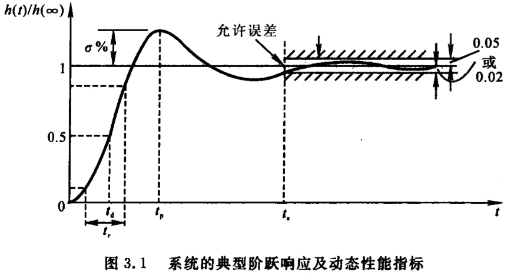
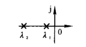
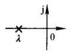
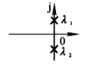
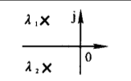
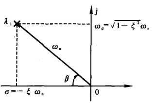

## 1.作用与特点
- 直接在时间域内对系统进行分析和校正
- 不方便
- 最基本的方法
- 是以后学习复域法、频域法的基础

## 2.时域性能指标
- 动态性能指标

  - 延迟时间$t_d$：阶跃响应第一次到达终值的50%的时间
  - 上升时间$t_r$：阶跃响应从终值的10%上升到终值的90%所需的时间
  - 峰值时间$t_p$：阶跃响应超过终值达到第一个峰值的时间
  - **调节时间**$t_s$：阶跃响应保持在终值$\pm$ 5%误差带内的时间
  - 超调量$\sigma$ %：
  $$\sigma\%=\frac{h(t_p)-h(\infty)}{h(\infty)}\times100\%$$

- 稳态性能指标：时间趋于无穷时系统实际输出与理想输出之间的误差

## 3.一阶系统的时间响应及动态性能
标准闭环传递函数形式：
$$
\Phi(s)=\frac{1}{Ts+1}
$$

其中T为时间常数

其阶跃响应为：
$$
h(t)=1-e^{-\frac{t}{T}}
$$

调节时间：$t_s=3T$

## 4.二阶系统的时间响应及动态性能指标
标准闭环传递函数形式：
$$
\begin{aligned}
\Phi(s) & =\frac{1}{T^2s^2+2T\xi s+1}    \\
\Phi(s) & =\frac{\omega_n^2}{s^2+2\xi\omega_ns+\omega_n^2}      \\
\end{aligned}
$$
其中$\xi$为阻尼比，$\omega_n$为无阻尼自然频率

闭环特征方程为：
$$
D(s)=s^2+2\xi\omega_ns+\omega_n^2=0
$$

其根为：
$$
\lambda_{1,2}=-\xi\omega_n\pm \omega_n\sqrt{\xi^2-1}
$$

---

- 1.$\xi>1$时为过阻尼情况

根为$\lambda_{1,2}=-\xi\omega_n\pm \omega_n\sqrt{\xi^2-1}$,是两个实根，分布：

调节时间$t_s$查表得

---
- 2.$\xi=1$时为临界阻尼情况

根为$\lambda_{1,2}=-\omega_n$，为两个相等得实根
分布：

- 3.$\xi=0$时为零阻尼情况
根为$\lambda_{1,2}=\pm i\omega_n$，为两个对称复根
分布：

- 4.$0<\xi<1$时为**欠阻尼**情况
根为$\lambda_{1,2}=-\xi\omega_n\pm i\omega_n\sqrt{1-\xi^2}$
分布：

根的极坐标表示为：

