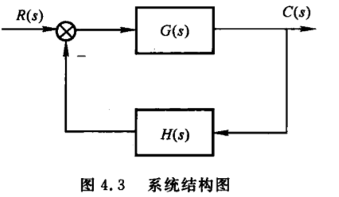
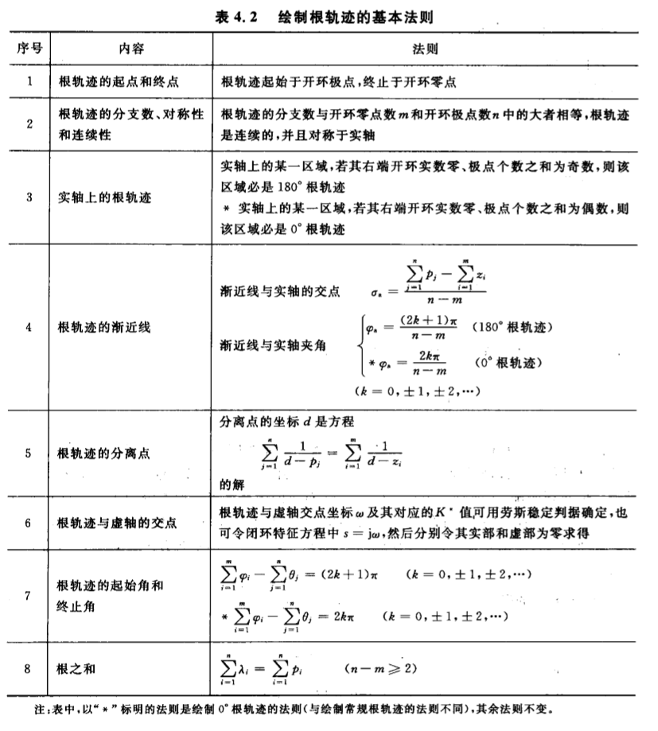
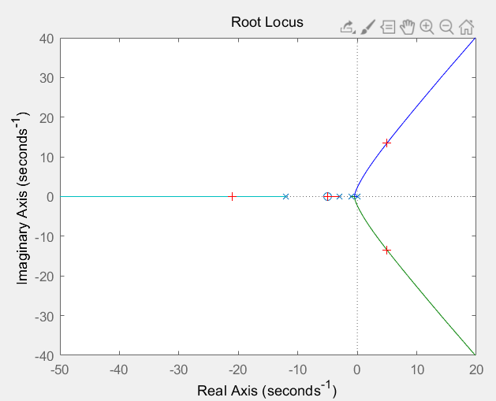

## 1.根轨迹基本概念

- 定义：开环系统中某一参数（例如：根轨迹增益$K^*$）从零变化到无穷大时，系统闭环传递函数的闭环特征方程的根在s平面上的移动轨迹

例：某单位反馈系统，其前向通路传递函数为$\frac{K}{s(0.5s+1)}$，此系统的开环传递函数为：
$$
G(s)=\frac{K}{s(0.5s+1)}=\frac{K^*}{s(s+2)}
$$
其中：$K^*=2K$

此系统的闭环传递函数为：
$$
\Phi(s)=\frac{K^*}{s^2+2s+K^*}
$$
令闭环特征方程等于零：
$$
s^2+2s+K^*=0
$$
解得特征根：
$$
\lambda_1=-1+\sqrt{1-K^*}	\\
\lambda_2=-1-\sqrt{1-K^*}
$$
让$K^*$从0变化到$+\infty$，得到的特征根$\lambda_1$、$\lambda_2$的变化就是根轨迹

## 2.闭环零极点与开环零极点之间的关系(定性)
带观测的系统：



其中$G(s)H(s)$使用首一标准型可表示为
$$
G(s)=K_G^*\frac{\prod_{i=1}^f(s-z_i)}{\prod_{i=1}^g(s-p_i)}
$$

$$
H(s)= K_H^*\frac{\prod_{j=f+1}^m(s-z_j)}{\prod_{j=g+1}^n(s-p_j)}
$$

其开环传递函数可表示为：
$$
G(s)H(s)=K_G^* K_H^*\frac{\prod_{i=1}^f(s-z_i) \prod_{j=f+1}^m(s-z_j)}{\prod_{i=1}^g(s-p_i) \prod_{j=g+1}^n(s-p_j)}
$$

令$K^*=K_G^* K_H^*$，此为开环增益，亦为系统根轨迹增益

简化得：
$$
G(s)H(s)=K^*\frac{\prod_{i=1}^m(s-z_i)}{\prod_{i=1}^n(s-p_i)}
$$

系统得闭环传递函数为：
$$
\begin{aligned}
\Phi(s) & = \frac{G(s)}{1+G(s)H(s)}     \\
        & = K_G^* \frac{\prod_{i=1}^f(s-z_i) \prod_{j=g+1}^n(s-p_j)}{\prod_{i=1}^n(s-p_i)+K^* \prod_{i=1}^m(s-z_i)}         \\
\end{aligned}
$$

对比发现:
- 闭环零点由前向通路传递函数$G(s)$的零点与反馈通道传递函数$H(s)$的极点组成
- 闭环极点与开环传递函数的零点、极点及增益都有关

总结：根轨迹法的**任务**：先求出开环传递函数的零极点以及根轨迹增益，然后用图解法找到闭环极点，再补上闭环零点，分析系统的性能

## 3.根轨迹方程
根据上节，某系统的开环传递函数为：
$$
G(s)H(s)=K^*\frac{\prod_{i=1}^m(s-z_i)}{\prod_{i=1}^n(s-p_i)}
$$

系统的闭环传递函数为：
$$
\begin{aligned}
\Phi(s) & = \frac{G(s)}{1+G(s)H(s)}     \\
\end{aligned}
$$

闭环特征方程为：
$$
1+G(s)H(s)=0
$$

即：
$$
G(s)H(s)=K^*\frac{\prod_{i=1}^m(s-z_i)}{\prod_{i=1}^n(s-p_i)}=-1
$$


由此式可以得出两个条件：

幅值条件：
$$
|G(s)H(s)|=K^*\frac{\prod_{i=1}^m|(s-z_i)|}{\prod_{i=1}^n|(s-p_i)|}=1
$$

相角条件：
$$
\begin{aligned}
\angle G(s)H(s) & = \Sigma_{i=1}^m \angle(s-z_i) - \Sigma_{j=1}^n \angle(s-p_j)     \\
                & = \Sigma_{i=1}^m \phi_i - \Sigma_{j=1}^n \theta_j     \\
                & = (2k+1)\pi       \\
                & k=0,\pm1,\pm2,...     \\
\end{aligned}
$$
其中$\Sigma \phi_i$、$\Sigma \theta_j$为开环零点、极点到根轨迹上某点的相角之和

分析：
- s平面上某点，只要能够满足相角条件
  - 此点一定在根轨迹上
  - 此点也能满足幅值条件
  - 此点对应的根轨迹增益可以通过幅值条件回代求出
- 相角条件是确定根轨迹S平面上一点是否在根轨迹上的充分必要条件


## 4.绘制根轨迹的基本法则
- 1.根轨迹起始于开环极点，终止于开环零点。若开环零点数m少于开环极点数n，则有n-m条根轨迹指向无穷远处
- 2.根轨迹的分支数量等于开环零点数m、开环极点数n中较大的。根轨迹连续并且关于实轴对称
- 3.实轴上某一区域，若右边开环零、极点数目之和为奇数，此区域必定为根轨迹区域
- 4.当开环极点个数n大于开环零点个数m时，有n-m条根轨迹沿着渐近线趋向于无穷远处。渐近线与实轴焦点为$\sigma_a$，与实轴夹角为$\phi_a$
$$
\phi_a=\frac{(2k+1)\pi}{n-m}
$$

$$
\sigma_a=\frac{\Sigma_{j=1}^n p_j - \Sigma_{i=1}^m z_i}{n-m}
$$

$$
k=0,\pm1,\pm2,...
$$

- 5.多条根轨迹的分离点d坐标方程为
$$
\Sigma_{j=1}^n \frac{1}{d-p_j}=\Sigma_{i=1}^m \frac{1}{d-z_i}
$$
- 6.根轨迹与虚轴的交点

- 7.根轨迹的起始角$\Theta_{p_i}$：根轨迹离开开环复数极点处的切线与正实轴的夹角。终止角$\phi_{z_i}$：根轨迹进入开环复数零点处的切线与正实轴的夹角。两者可用相角条件求出

- 8.当系统开环传递函数$G(s)H(s)$的分子、分母阶次差$(n-m)$大于等于2时，系统闭环极点之和等于系统开环极点之和



## 5.matlab求解根轨迹
```matlab
z=[-5];
p=[0,-1,-3,-12];
k=[1]

G=zpk(z,p,k);
rlocus(G)
[k,poles]=rlocfind(G)
```


## 6.广义根轨迹
意义：以上所研究的根轨迹相关，都是研究在负反馈条件下，根轨迹增益$K^*$变化时的根轨迹。然而，有时需要分析除$K^*$外其他参量变化对系统性能的影响，此为广义根轨迹

### 6.1.参数根轨迹
- 除根轨迹增益$K^*$以外其他参量从零变化到无穷大时的根轨迹为参数根轨迹
- 参数根轨迹的绘制法则与常规根轨迹绘制完全相似。
- 但需要引入“等效开环传递函数”，将绘制参数根轨迹的问题转化为绘制$K^*$变化时的常规根轨迹的形式

例：
某单位反馈系统的开环传递函数为：
$$
G(s)=\frac{\frac{1}{4}(s+a)}{s^2(s+1)}
$$
要求绘制当$a从0 \to \infty$时的根轨迹

系统的闭环传递函数为：
$$
\phi(s)=\frac{\frac{1}{4}(s+a)}{s^3+s^2+\frac{1}{4}(s+a)}
$$

闭环特征方程为：
$$
D(s)=s^3+s^2+\frac{1}{4}(s+a)=0
$$

来构造等效开环传递函数，将含有可变参数的项放在分子上，保证所构造的等效开环传递函数所对应的闭环传递函数的闭环特征方程与原来一样
$$
G^*(s)=\frac{\frac{1}{4}a}{s(s^2+s+\frac{1}{4})}
$$

但是等效开环传递函数对应的闭环传递函数的闭环零点与原系统的闭环零点并不一致


### 6.2零度根轨迹
- 在负反馈条件下，根轨迹方程为：$G(s)H(s)=-1$，相角条件为：$\angle G(s)H(s)=(2k+1)\pi$，此种情况下为常规根轨迹，也称为$180^o$根轨迹
- 在正反馈条件下，根轨迹方程为：$G(s)H(s)=1$，相角条件为：$\angle G(s)H(s)=2k\pi$，此种情况下为零度根轨迹，也称为$0^o$根轨迹

零度根轨迹的绘制与常规根轨迹的绘制有所不同

$0^o$根轨迹方程为：
$$
K^* \frac{\prod_{i=1}^m (s-z_i)}{\prod_{j=1}^n (s-p_j)}=1
$$

幅值条件：
$$
|G(s)H(s)|=K^* \frac{\prod_{i=1}^m |(s-z_i)|}{\prod_{j=1}^n |(s-p_j)|}=1
$$

相角条件：
$$
\angle G(s)H(s)=\Sigma_{i=1}^m \angle(s-z_i) - \Sigma_{j=1}^n \angle (s-p_j)=\Sigma_{i=1}^m \phi_i - \Sigma_{j=1}^n\theta_j=2k\pi
$$

对比常规根轨迹，发现：两者幅值条件是相同的，相角条件则不一样。所以，对于绘制根轨迹的法则，涉及到相角条件的需要做出修改，具体地，法则3、4、7要修改。

修改后法则：
- 3.实轴上某一区域，若右边开环零、极点数目之和为偶数，此区域必定为根轨迹区域
- 4.当开环极点个数n大于开环零点个数m时，有n-m条根轨迹沿着渐近线趋向于无穷远处。渐近线与实轴焦点为$\sigma_a$，与实轴夹$\phi_a$
$$
\phi_a=\frac{2k\pi}{n-m}
$$

$$
\sigma_a=\frac{\Sigma_{j=1}^n p_j - \Sigma_{i=1}^m z_i}{n-m}
$$

$$
k=0,\pm1,\pm2,...
$$

- 7.根轨迹的起始角$\theta_{p_i}$：根轨迹离开开环复数极点处的切线与正实轴的夹角。终止角$\phi_{z_i}$：根轨迹进入开环复数零点处的切线与正实轴的夹角。两者可用相角条件求出


