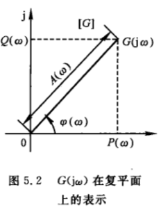
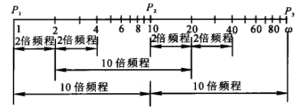

## 1.线性系统的频域分析与校正

频域分析的研究意义：
- 前面分别学习的时域内的分析法和根轨迹分析法，根轨迹法实际是复域分析法
- 频域法是基于频率特性或者频率响应对系统进行分析和设计的一种**图解方法**，也称为频率响应法
- 其优点有：
  - 系统的传递函数难以确定时，可以通过实验法确定频率特性
  - 一定条件下，能够推广到非线性系统中

## 前提补充
欧拉公式：
$$
\begin{aligned}
e^{it}  & = cost+isint    \\
e^{-it} & = cost-isint    \\
cost    & = \frac{e^{it}+e^{-it}}{2}     \\
sint    & = \frac{e^{it}-e^{-it}}{2}
\end{aligned}
$$

拉普拉斯变换
$$
F(s)=\int_0^{+\infty} f(t) e^{-st} dt
$$

正弦信号的拉普拉斯变换
$$
\begin{aligned}
r(t) & = Asin\omega t       \\
R(s) & = \int_0^{+\infty} Asin\omega t e^{-st} dt    \\
     & = -\frac{A}{s} \int_0^{+\infty} sin\omega t de^{-st}    \\
     & = -\frac{A}{s}[sin\omega t e^{-st}|_0^{+\infty}-\omega\int_0^{+\infty} e^{-st} cos\omega t dt]   \\
     & = \frac{A \omega}{s} \int_0^{+\infty} e^{-st} cos\omega t dt     \\
     & = -\frac{A \omega}{s^2} \int_0^{+\infty} cos\omega t de^{-st}    \\
     & = -\frac{A \omega}{s^2} [cos\omega t e^{-st}|_0^{+\infty}+\omega \int_0^{+\infty}e^{-st} sin\omega t]    \\
     & = -\frac{A \omega}{s^2} [0-1+w\int_0^{+\infty}e^{-st} sin\omega t]       \\

     得方程式：
R(s) & = \frac{A \omega}{s^2}[1-\frac{1}{A}\omega R(s)]   \\
R(s) & = \frac{A\omega}{s^2+\omega^2}       \\
\end{aligned}
$$

## 2.频率特性的基本概念
### 2.1 频率响应
线性系统在输入为正弦信号时，系统的稳态输出随频率从$0 \to +\infty$变化的规律，称为系统的频率响应

推导说明：
系统的传递函数可表示为：
$$
G(s)=\frac{C(s)}{R(s)}=\frac{M(s)}{(s+p_1)(s+p_2)...(s+p_n)}
$$

当输入信号$r(t)=Xsin\omega t$时
$$
R(s)=\frac{X\omega}{s^2+\omega^2}
$$

则输出信号为：
$$
\begin{aligned}
C(s) & = R(s)G(s)   \\
     & = \frac{M(s)}{(s+p_1)(s+p_2)...(s+p_n)} \frac{X\omega}{s^2+\omega^2}   \\
     & = \frac{C_1}{s+p_1}+\frac{C_2}{s+p_2}+...+\frac{C_n}{s+p_n}+\frac{C_a}{s+j\omega}+\frac{C_{-a}}{s-j\omega}   \\
\end{aligned}
$$

拉氏反变换后
$$
c(t)=C_1e^{-p_1t}+C_2e^{-p_2t}+...+C_ne^{-p_nt}+C_a e^{j\omega t}+C_{-a} e^{-j\omega t}
$$

如果系统稳定，上式除了最后两项，都会衰减为0，所以输出的稳态分量为
$$
c_s(t)=C_a e^{j\omega t}+C_{-a} e^{-j\omega t}
$$

系数$C_a$、$C_{-a}$可由留数法求得

$$
\begin{aligned}
C_a & = G(s)\frac{X\omega}{(s+j\omega)(s-j\omega)}(s-j\omega) |_{s=j\omega}=\frac{XG(j\omega)}{2j}    \\
C_{-a} & = G(s)\frac{X\omega}{(s+j\omega)(s-j\omega)}(s-j\omega) |_{s=-j\omega}=-\frac{XG(-j\omega)}{2j}    \\
\end{aligned}
$$

因为
$$
G(j\omega)=|G(j\omega|e^{j\angle G(j\omega)}
$$

所以系统输出的稳态分量可写为
$$
\begin{aligned}
c_s(t) & = \frac{XG(j\omega)}{2j} e^{j\omega t}-\frac{XG(-j\omega)}{2j} e^{-j\omega t}   \\
       & = X\frac{|G(j\omega|e^{j\angle G(j\omega)}e^{jwt}-|G(j\omega|e^{-j\angle G(j\omega)}e^{-jwt}}{2j}    \\
       & = X\frac{|G(j\omega|}{2j}[e^{j\angle G(j\omega)}e^{jwt}-e^{-j\angle G(j\omega)}e^{-jwt}]   \\
       & = X\frac{|G(j\omega|}{2j}[e^{j(\angle G(j\omega)+wt)}-e^{-j(\angle G(j\omega)+wt)}]   \\
       & = X|G(j\omega)|sin[\omega t+\angle G(j\omega)]    \\
\end{aligned}
$$

综上
输入为：$r(t)=Xsin\omega t$时，

输出的稳态分量为：$c_s(t)=X|G(j\omega)|sin[\omega t+\angle G(j\omega)]$

比较发现：
- 线性系统在输入正弦信号时，系统稳态输出为与输入同频率的正弦信号
- 输出正弦信号与输入正弦信号幅值之比为$|G(j\omega)|$
- 输出正弦信号与输入正弦信号的相角之差为$\angle G(j\omega)$

### 2.2频率特性
系统的频率特性即为$G(j\omega)$,定义为系统稳态正弦响应与输入正弦信号的复数比
$$
\begin{aligned}
G(j\omega) & = \frac{X|G(j\omega)| e^{j\angle G(j\omega)}}{Xe^{j0}}   \\
           & = |G(j\omega)|e^{j\angle G(j\omega)}   \\
           & = A(\omega)e^{j\phi(\omega)}     \\
\end{aligned}
$$

其中$A(\omega)=|G(j\omega)|$称为系统的幅频特性,$\phi(\omega)=\angle G(j \omega)$为系统的相频特性

分析：
若已经得知系统的传递函数，则令$s=j\omega$就得到系统的频率特性$G(j\omega)$

如对于一阶系统$G(s)=\frac{1}{Ts+1}$，令$s=j\omega$，得一阶系统的频率特性$G(j\omega)=\frac{1}{Tj\omega+1}$

### 2.3频率特性的图形表达方式
在使用频率法分析、设计系统时，并不是直接用频率特性的函数表达式，而是将其绘制成一些曲线，借助这些曲线对系统进行图解

|序号|名称|图形常用名|坐标系|
|:-:|:-:|:-:|:-:|:-:|:-:|
|1|幅频、相频特性曲线|频率特性图|直角坐标系
|2|幅相频率特性曲线|极坐标图、**奈奎斯特图**|极坐标
|3|对数幅频、相频特性曲线|对数频率特性、**伯德图**|半对数坐标
|4|对数幅相特性曲线|对数幅相图、尼柯尔斯图|对数幅相图

其中第2、3种使用较为广泛

- 1.频率特性曲线：频率特性$|G(j\omega)|$幅值和相角随$\omega=0 \to +\infty$变化，在直角坐标系所绘得
- 2.幅相频率特性曲线：因为频率特性$|G(j\omega)|$可以使用极坐标的形式表示，此曲线就是在$\omega=0 \to +\infty时，向量$G(j\omega)$的端点在复平面G上绘出来的轨迹
  - 

- 3.**对数频率特性曲线**(重要)：
  - 又称 Bode 伯德图
  - 频率特性曲线中最常用的
  - Bode图中幅频特性为$G(j\omega)$的对数值$20lg|G(j\omega)|$与$\omega$之间的关系；相频则为则是$G(j\omega)$的相角$\phi(\omega)$与频率$\omega$之间的关系
  - 在作图时，为了方便，将幅频、相频特性曲线绘制在一起，使用同一个横坐标作为频率$\omega$轴，横坐标虽然标注的是$\omega$的实际值，但是却采用对数刻度，单位为$rad/s$，这意味着实际距离是按$\omega$的对数$lg\omega$来取的。例：坐标轴上两点$\omega_1$和$\omega_2$（$\omega_1<\omega_2$），这两点之间的距离为$lg\omega_2-lg\omega_1=lg\frac{\omega_2}{\omega_1}$，而不是$\omega_2-\omega_1$
  - 频率$\omega$每变化10倍称为一个十倍频程，或称“旬距”，记作dec
    - 
  - 对数幅频特性曲线的纵坐标为$L(\omega)=20lgA(\omega)$，称为对数幅值，单位为dB
  - 对数幅频特性曲线的纵坐标都经过对数转换，所以纵坐标按分贝值是线性刻度的，$A(\omega)$幅值放大10倍，$L(\omega)$就增加20dB
  - 对数相频特性曲线纵坐标为相角，单位为度，线性刻度

- 对数频率特性曲线的优点：
  - 横坐标采用对数刻度，相对展宽了低频段，压缩了高频段，而低频段频率特性的形状对于控制系统的性能有较重要的意义
  - 对数运算可以将乘除转化为加减运算，当绘制多个环节串联而成的系统时，可以分别求出各环节的对数幅频特性，然后加减运算即可
  - 在曲线上可用直线近似代替，具有相当的精度
  - 将实验所得的频率特性数据用分段直线近似代替，很容易得出实验对象的频率特性表达式或者是传递函数

- 4.对数幅相特性曲线
  - Nichols曲线
  - 由对数幅频特性与对数相频特性合并而成
  - 横轴为相角$\phi(\omega)$,单位为度
  - 纵轴为对数幅频值$L(\omega)=20lgA(\omega)$

