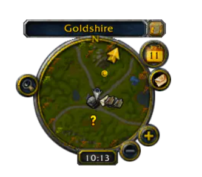
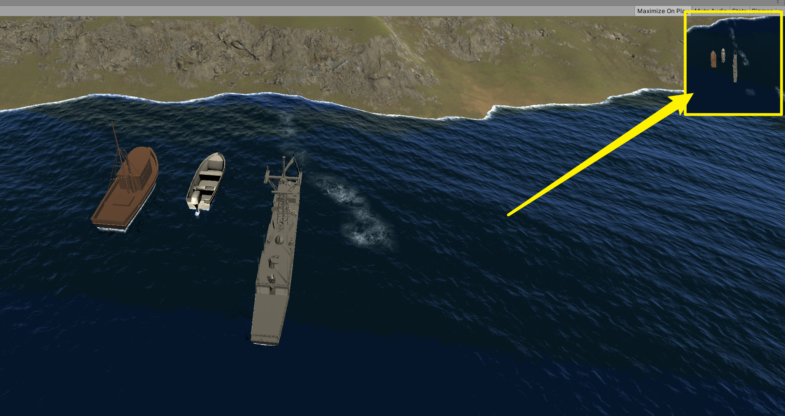
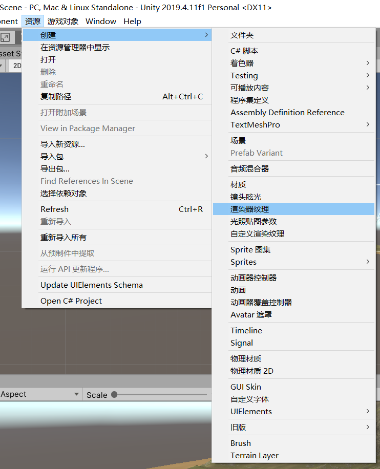
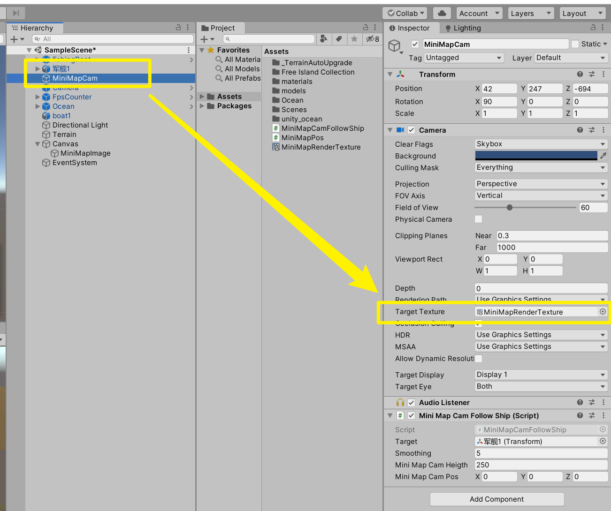

## 小地图（雷达）
- 用于显示周围环境信息
- 一般为俯视视角
- 小地图以被跟踪对象（主角）为中心
- 可用图标来代替被跟踪对象的真实模型

## 实现步骤：
### 1.另创建一个camera
- 常命名为“miniMapCamera”
- 用于小地图的画面拍摄
- 将其设为被跟踪对象的**子对象**
- 适当调整此相机与被跟踪物体的相对位置

### 2.渲染到UI层
- 创建**Render Texture**
- 
- 常命名为“miniMapCamera Render Texture”
- 选中miniMapCamera，在检视面板将Target Texture设置为刚创建的miniMapCamera Render
- 

