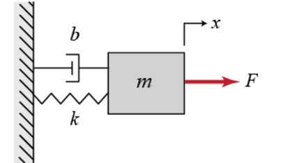

## 模型：弹簧阻尼系统，建立状态空间方程

使用牛顿第二定律
$$f(t)-kx-b \dot{x}=m \ddot{x}$$

令$输入 u(t)=f(t)$整理得：
$$m \ddot{x}+b \dot{x} +kx=u(t)$$

选择状态变量以消除高阶项
$$
\begin{aligned}
Z_1=x \\
Z_2=\dot{x}
\end{aligned}
$$

### 代入得：
$$m \dot{Z_2}+b \dot{Z_1}+k Z_1=u(t)$$

### 得系统状态：
$$
\begin{aligned}
\begin{bmatrix} \dot{Z_1} \\ \dot{Z_2} \end{bmatrix}
=
\begin{bmatrix} 0 & 1 \\ -\frac{k}{m} & -\frac{b}{m}\end{bmatrix}
\begin{bmatrix} Z_1 \\ Z_2 \end{bmatrix}
+
\begin{bmatrix} 0 \\ \frac{1}{m} \end{bmatrix}
\begin{bmatrix} u(t) \end{bmatrix}
\end{aligned}
$$

### 得系统输出：
$$
\begin{aligned}
y=
\begin{bmatrix} 1 & 0\end{bmatrix}
\begin{bmatrix} Z_1 \\ Z_2 \end{bmatrix}
+
\begin{bmatrix} 0 \end{bmatrix}
\begin{bmatrix} u(t)\end{bmatrix}
\end{aligned}
$$

